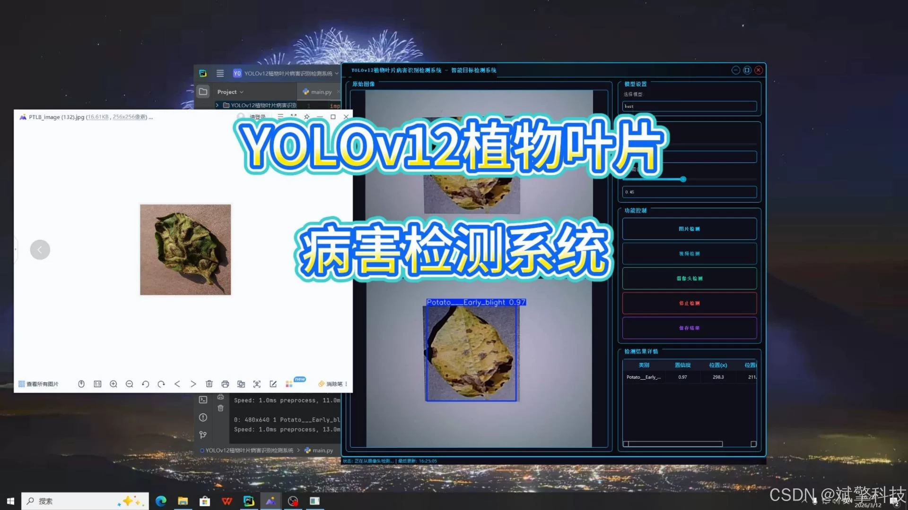
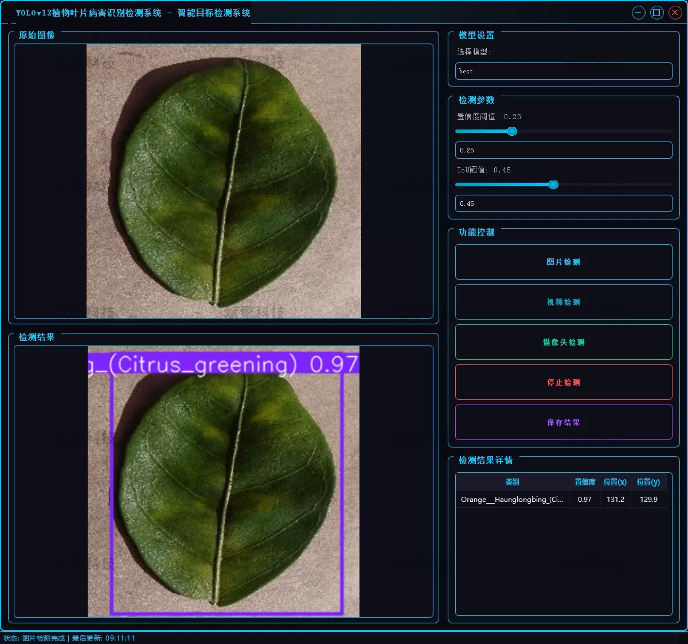
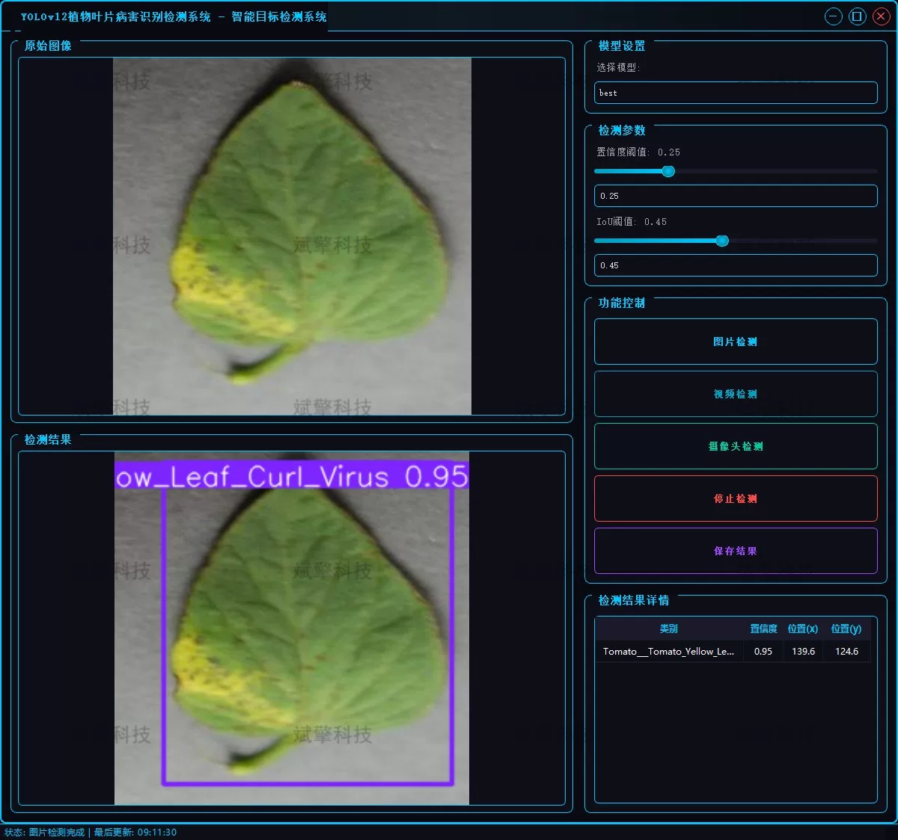
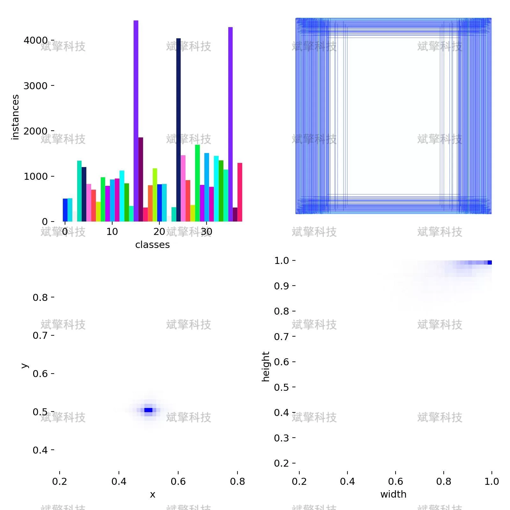
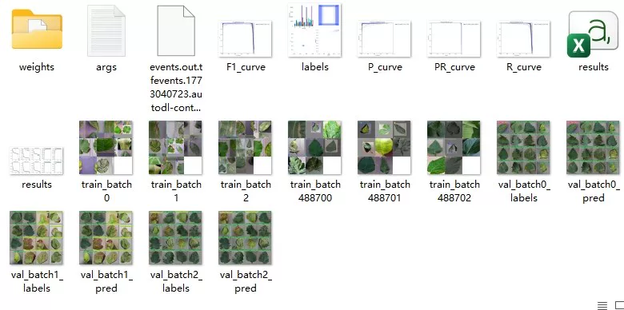
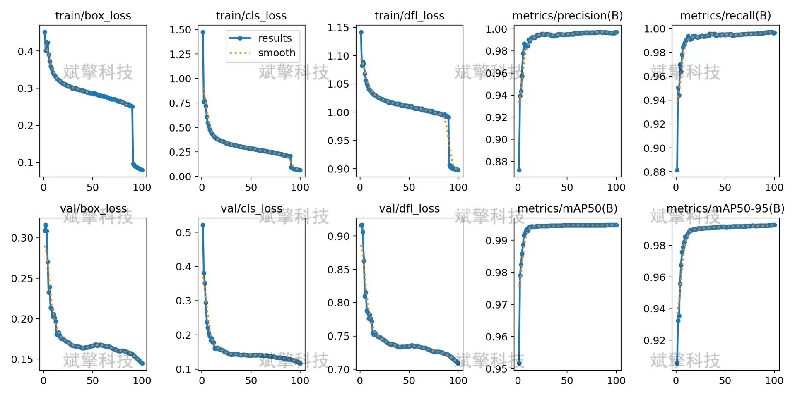
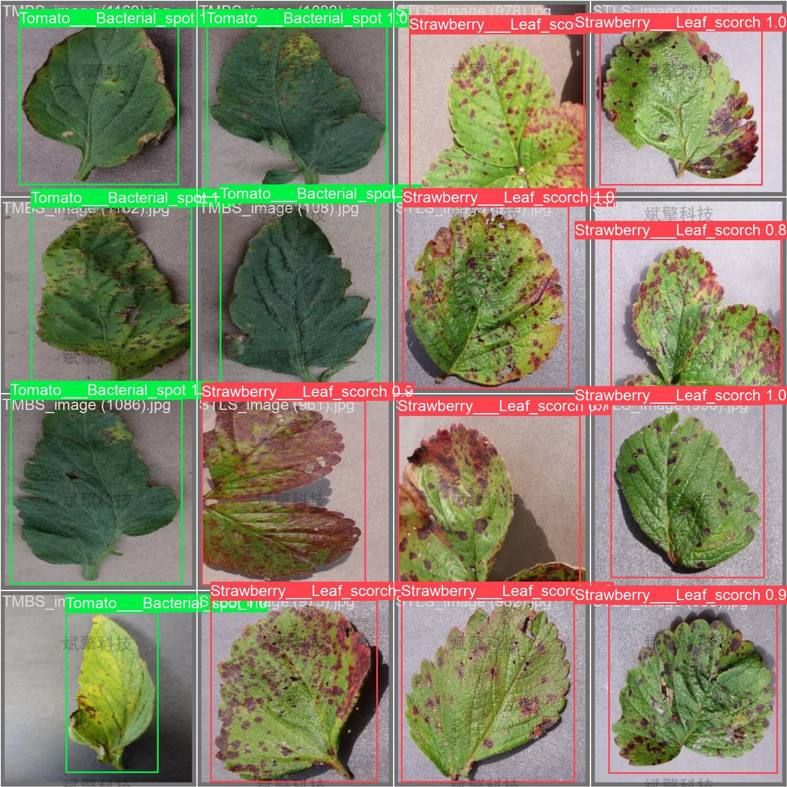

# YOLOv12 Plant Disease Detection System

## Body

YOLOv12 Plant Disease Detection System Based on Deep Learning - YOLOv12+YOLO dataset + UI interface + login and registration interface + Python project source code + model

This system is based on the latest YOLOv12 object detection algorithm, constructing a high-precision detection model that includes 38 categories of plant states (covering healthy leaves as well as specific diseases in crops such as apples, tomatoes, and corn). The system not only possesses high-accuracy image recognition capabilities but also expands video stream detection and real-time camera detection functions, enabling real-time, accurate disease localization and classification of leaf images collected.

System Function Overview

✅ User Login and Registration: Supports password verification and security validation.

✅ Three Detection Modes: Based on the YOLOv12 model, supports image, video, and real-time camera detection, accurately identifying targets.

✅ Dual-Screen Comparison: Displays the original scene and detection results on the same screen.

✅ Data Visualization: Real-time table displaying the category, confidence, and coordinates of detected targets.

✅ Intelligent Parameter Tuning: Offers a confidence slide bar to dynamically optimize detection accuracy, adapting to different scene requirements.

✅ Sci-Fi Interactive Interface: Dark theme combined with dynamic light effects, reducing visual fatigue and enhancing operational experience.

✅ Multi-thread High-Performance Architecture: Independent detection threads ensure smooth operation, real-time status prompts, and rapid response without lag.

Dataset Introduction

The dataset consists of a total of 54,293 high-quality images

## Images

## Payment

Here is a pay link on Stripe ( https://buy.stripe.com/3cs8yP7sY87d0vu9AB ). Please contact me lonlonago@foxmail.com after funding $89, and I will send you a complete data files , thank you!

